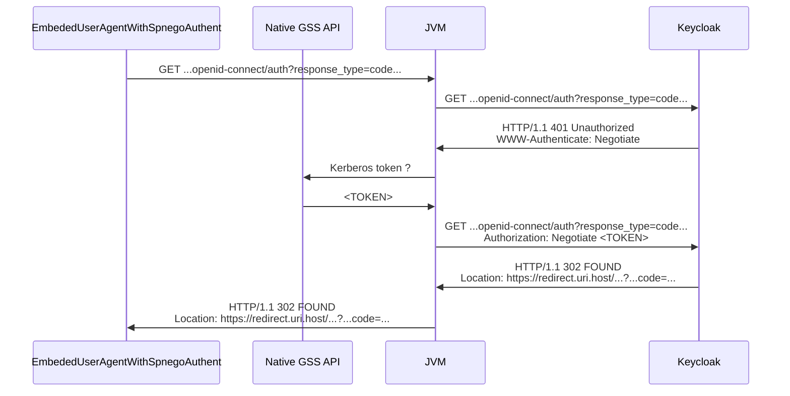

# CLI to request REST API from OpenAPI specification with Spring Shell, Spring Security and SPNEGO authentication via Java

This POC demonstrate how one can create a CLI to request a REST API with protected resources. The CLI commands are
generated from the Open API specification of the REST API.

## Components

- The **cli** module :
    - creates a CLI from Spring Shell. The Spring Shell commands are generated at runtime based on a OpenAPI
      spec provided to the application.
    - processes commands requesting the REST API using a RestClient which is built over a RestClient.Builder
      provided by the spring-oauth-cli
- the **spring-oauth-cli** module :
    - provides Bearer authentication for the RestClients built over the provided RestClient.Builder
    - configure the RestClientBuilder with an OAuth2ClientHttpRequestInterceptor to process authentication
    - authenticates resource owner to get authorization code with SPNEGO (using JVM feature to call native GSS API) :
      class EmbededUserAgentWithSpnegoAuthent
    - the OAuth2ClientHttpRequestInterceptor is plugged on a OAuth2AuthorizedClientManager which authorizes requests
      using a custom AuthorizationCodeOAuth2AuthorizedClientProvider. The custom AuthorizationCodeOAuth2AuthorizedClientProvider
      authorizes clients with an oauth2 authorization code flow with the help of Spring Security derived classes which
      do not depend on a servlet context

## Classes derived from Spring Security

In order to provide OAuth2 authorization code flow without a servlet context a few classes from Spring Security had to
be rewritten totally or partially :

| Rewritten Class in module `spring-oauth-cli`      | Corresponding class in Spring Security                          | Comments                                                                                                                                                                                                                                                                                                                             |
|---------------------------------------------------|-----------------------------------------------------------------|--------------------------------------------------------------------------------------------------------------------------------------------------------------------------------------------------------------------------------------------------------------------------------------------------------------------------------------|
| MyAuthorizationCodeOAuth2AuthorizedClientProvider | o.s.s.o.client.AuthorizationCodeOAuth2AuthorizedClientProvider  | Rewritten class directly calls method responsible for providing OAuth2AccessTokenResponse whereas Spring Security Implementation raises an exception to trigger the servlet filter OAuth2AuthorizationRequestRedirectFilter to start authorization code flow                                                                         |
| NativeAppFlowAuthorizationService                 | o.s.s.o.client.web.OAuth2AuthorizationRequestRedirectFilter     | Rewritten class directly calls a service to retrieve authorization code whereas Spring Security Implementation redirects browser to the authorization endpoint                                                                                                                                                                       |
| NativeAppFlowAuthorizationService                 | o.s.s.o.client.web.OAuth2AuthorizationCodeGrantFilter           | Rewritten is called directly whereas spring security implementation is triggered as a servlet filter. The en rewritten class returns directly to caller then OAuth2AccessTokenResponse whereas spring security implementation stores an OAuth2AuthorizedClient in a authorizedClientRepository and redirects to the original request |
| NativeAppOAuth2AuthorizationRequestResolver       | o.s.s.o.client.web.DefaultOAuth2AuthorizationRequestResolver    | To find redirect uri, the spring implementation has to find the registrationId in a parameter of the request whereas the registration object is provided by caller to the rewritten class. Also th rewritten class does not support redirect uri placeholders                                                                        |

## Tests

No test available for the moment : a full test would require to execute the CLI in a context with a native GSS api plugged 
to a controlled kerberos server itself pluged to an authorization server. Hard work.

## Authentication with SPNEGO

Class `EmbededUserAgentWithSpnegoAuthent` authenticates user calling the authorization endpoint executing the authorization request with 
JDK builtin HTTP client which authenticates user using a native SPNEGO token. Native SPNEGO token is a kerberos token provided by the
native (the OS one, not the java one) GSS API. The following diagram describes the authentication sequence :

NB : the authorization server is named by its implementation : Keycloak

## Demo

Can be executed in a local environment where SPNEGO is enabled with a kerberos server plugged to an authorization server.
Just specify with properties a client registration for the authorization server : the property `poc.java.oauth.restclient.registration.id`
must be valued with the id of the client registration. Also provide absolute path to a OpenAPI spec (OAS) file in property 
`poc.java.oauth.openapi.spec.resource`.

The CLI start in interactive mode. Use the OAS `operationId` property of an endpoint as the command name to request the endpoint
The parameters must be given as options of the command.

The CLI uses the first OAS server element as the base URI. 

## Not available

- Commands do not accept bodies
- Auto completion is unavailable
- Refresh token are not used
- security elements of OAS ar ignored
